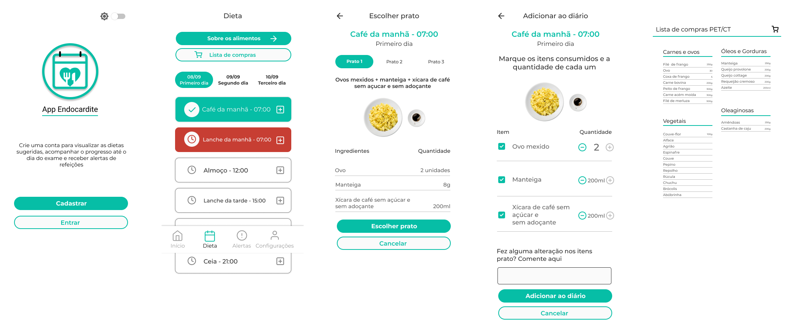

# App Endocardite

Project aims to provide a specific diet with calories counted for a medical examination. In the application it is possible to register the meals made and the amount of food ingested. In addition to following the calendar and receiving information about the exam.

## Technologies Used
- Flutter
- Dart
- Cubit
- Modular
- Firebase
- SharedPreferences

## Installation and Usage
To install and use the project, follow these steps:

- Make sure you have the Flutter SDK installed on your development environment.

- Clone this repository to your local environment.
`https://github.com/GCAS-UFF/cardiac_petct.git`

- Navigate to the project directory.
`cd cardiac_petct`

- Run the command to fetch the necessary dependencies.
`flutter pub get`

- Start the application on an emulator or connected device.
`flutter run`

You can now explore the App Endocardite.
